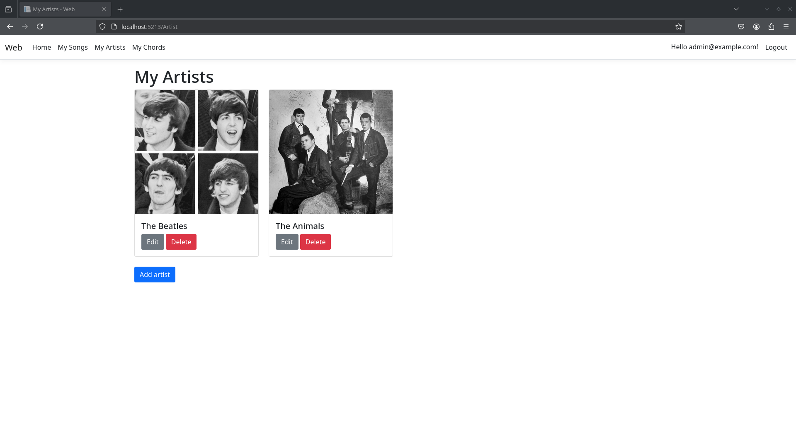
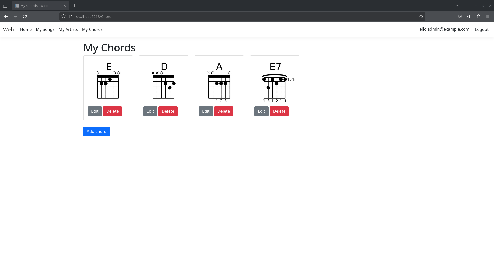
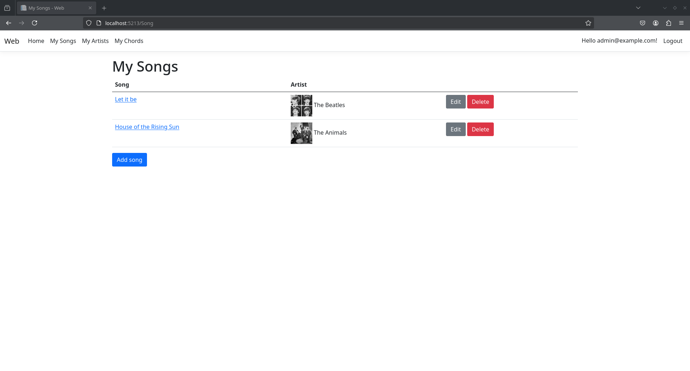
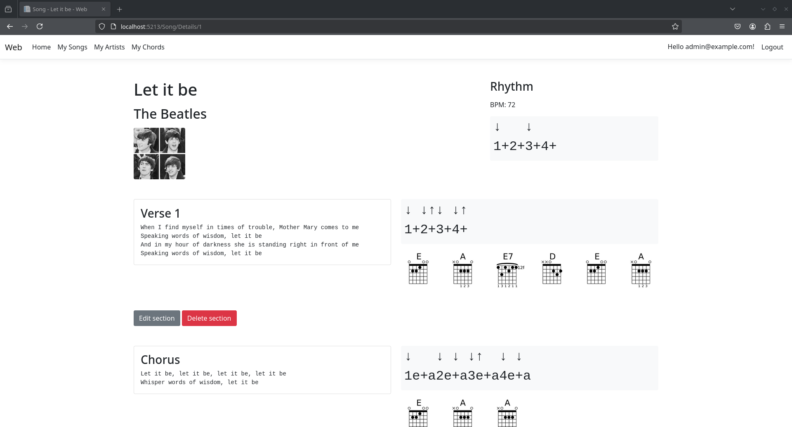

# About

Digital Songbook is a very creatively named web application designed to help musicians organize and track the chords and songs they've learned.

It was made using ASP.NET MVC (with some bootstrap and jquery) and SQL Server for one of my university classes.

# Preview




<small>(just an example, please don't play let it be like this)</small>

# Running the Application

## Requirements

- .NET 8 SDK
- .NET Entity Framework (dotnet-ef) utility
- Docker

## Instructions

### Setting up the Database

1. **Start the database engine in Docker**:

 ```bash
 docker run -e "ACCEPT_EULA=Y" -e "MSSQL_SA_PASSWORD=Password123" -p 1433:1433 --name db --hostname db -d mcr.microsoft.com/mssql/server:2022-latest
 ```

2. **Create a database called ```db``` in the container**:

```bash
docker exec db ./opt/mssql-tools18/bin/sqlcmd -U sa -P Password123 -C -Q "CREATE DATABASE db;"
```

### Running the Application

1. **Clone the repository and cd into the root of the project**:

```bash
git clone git@github.com:alen127/digital-songbook.git && cd digital-songbook
```


2. **Restore dependencies**:

```bash
dotnet restore
```

3. **Populate the database**: 

```bash
dotnet-ef database update --startup-project Web --project DAL
```

4. **Start the application**: 

```bash
dotnet run --project Web
```

After starting the application, open the link printed to the console in your favorite web browser (e.g., https://localhost:5213 and Internet Explorer 8)

### Logging In

You can register a new user or log in with an existing one:

- **Email**: ```admin@example.com```
- **Password**: ```Admin123!```
